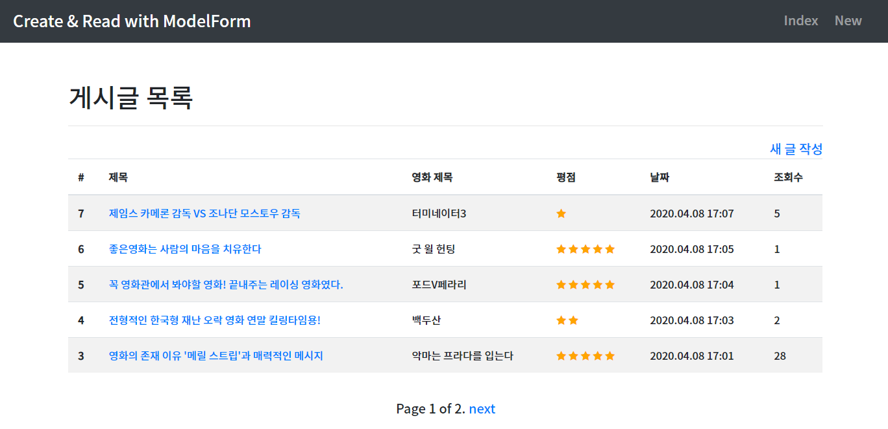
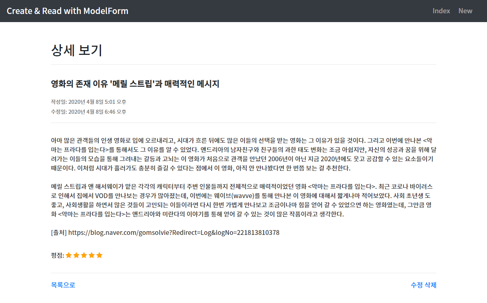
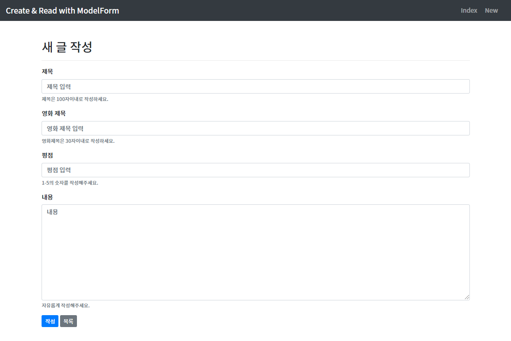
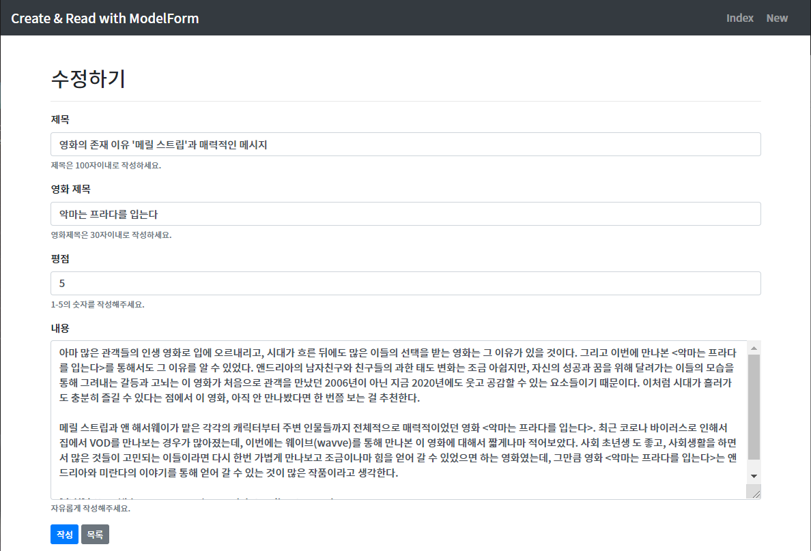

# Django_pjt2

## 구현 과정

### 01. Model

아래와 같은 방법으로 Review 라는 이름의 Model을 생성함

조회수를 저장하는 hits라는 정보를 추가 저장하였음

```python
from django.db import models
class Review(models.Model):
   title = models.CharField(max_length=100)
   movie_title = models.CharField(max_length=30)
   rank = models.IntegerField()
   content = models.TextField()
   created_at = models.DateTimeField(auto_now_add=True)
   updated_at = models.DateTimeField(auto_now=True)
   hits = models.IntegerField(default=0)
```


### 02. Form

* title, movie_title, rank, content 항목의 데이터를 검증하고, 에러메세지, HTML을 관리하기 위해 아래와 같은 ModelForm을 생성하여 사용함
* rank 항목은 MaxValueValidator와 MinlueValidator를 통해 1-5 사이 숫자로 제한하였음

```python
from django import forms
from .models import Review
from django.core.validators import MinValueValidator, MaxValueValidator

class ReviewForm(forms.ModelForm):
    title = forms.CharField(
                max_length=100,
                label='제목',
                help_text='제목은 100자이내로 작성하세요.',
                required=True,
                widget=forms.TextInput(
                        attrs={
                            'class': 'form-control',
                            'placeholder': '제목 입력',
                        }
                    )
            )

    movie_title = forms.CharField(
                max_length=30,
                label='영화 제목',
                help_text='영화제목은 30자이내로 작성하세요.',
                required=True,
                widget=forms.TextInput(
                        attrs={
                            'class': 'form-control',
                            'placeholder': '영화 제목 입력',
                        }
                    )
            )

    rank = forms.IntegerField(
                label='평점',
                required=True,
                help_text='1-5의 숫자를 작성해주세요.',
                validators=[MaxValueValidator(5), MinValueValidator(1)],
                widget=forms.NumberInput(
                        attrs={
                            'class': 'form-control',
                            'placeholder': '평점 입력',
                        }
                    )
            )

    content = forms.CharField(
                label='내용',
                help_text='자유롭게 작성해주세요.',
                required=True,
                widget=forms.Textarea(
                        attrs={
                            'row': 5,
                            'col': 50,
                        }
                    )
            )

    class Meta:
        model = Review
        fields = ['title', 'movie_title', 'rank', 'content']
```


### 03. Admin

* 다음과 같이 admin.py를 작성하여 모델 Review를 관리자 페이지에서 데이터를 생성, 조회, 수정, 삭제할 수 있게 함

```python
from django.contrib import admin
from .models import Review

admin.site.register(Review)
```


### 04. URL

| HTTP Verb  | URL 패턴                       | 설명                        |
| ---------- | ------------------------------ | --------------------------- |
| GET & POST | /community/create/             | 신규 리뷰 생성 및 Form 표시 |
| GET        | /community/                    | 전체 리뷰 목록 조회 페이지  |
| GET        | /community/<review_pk>/        | 단일 리뷰 상세 조회 페이지  |
| GET & POST | /community/<review_pk>/update/ | 기존 리뷰 수정 및 Form 표시 |
| POST       | /community/<review_pk>/delete/ | 기존 리뷰 삭제              |


### 05. View & Template

* 모든 HTML 파일은 base.html을 extends하여 사용하였음

* base.html 은 모든 페이지가 공유하는 상단 네비게이션 바를 표시하며, request 받은 URL을 활용하여 아래와 같은 조건문을 사용하여 현재 페이지의 상태를 달리 표시함

  ```python
  
  	<h2>게시글 목록</h2>
  
  	<h2>새 글 작성</h2>
  
  	<h2>상세 보기</h2>
  
  	<h2>수정하기</h2>
  
  ```

* 새로운 리뷰 생성
  * HTTP method GET
    * 사용자에게 응답으로 제공하는 HTML은 form.html 이며, (title, movie_title, rank, content를 반드시 포함해야함
    * Form에 작성한 정보는 제출시 POST방식으로 요청과 데이터를 전송
  * HTTP method POST
    * 기존에 정의한 ModelForm을 사용하여 데이터를 검증
    * 데이터가 유효하다면 요청과 함께 전송된 데이터를 데이터베이스에 저장하고 단일 리뷰 상세 조회 페이지로 Redirect 함
    * 데이터가 유효하지 않다면 에러 메시지를 표시하고, 데이터를 작성하는 Form 을 사용
      자 화면에 표시함
* 단일 리뷰 상세 조회
  * review_pk 를 pk 로 갖는 리뷰 데이터가 없을 경우, 404 에러 페이지를 리턴
  * review_detail.html 에서는  조회하는 리뷰의 title, movie_title , rank , content , created_at , updated_at 을 표시함
  * review_detail.html 에서는 사용자가 현재 조회중인 게시글을 수정, 삭제 할수 있는 링크가 포함되어있음
* 기존 리뷰 수정
  * URL 을 통해 함께 전달된 review_pk 를 pk 로 갖는 리뷰를 수정함
  * review_pk 를 pk 로 갖는 리뷰 데이터가 없을 경우, 404 에러 페이지를 리턴
* 기존 리뷰 삭제
  * URL 을 통해 함께 전달된 review_pk 를 pk 로 갖는 리뷰를 삭제
  * review_pk 를 pk로 갖는 리뷰 데이터가 없을 경우, 404 에러 페이지를 리턴
  * 삭제가 완료되면 전체 리뷰 목록 조회 페이지로 Redirect


## 어려웠던 부분

### 01. Pagination을 구현 하는 과정

> **reviews = Review.objects.all().order_by('-id')**

Review 클래스의 모든 객체들을 역순으로 review에 담아둠

> **paginator = Paginator(reviews, 5)**

위에서 import한 **Paginator**에서 첫 번째로 페이지로 분할될 객체, 두 번째로 한 페이지에 담길 객체의 수를 받는다.

> **page = request.GET.get('page')**

GET 방식으로 정보를 받아오는 데이터를 가르킨다. 여기서 page에 해당되는 value를 가져오면 page의 번호를 리턴 받을 수 있다.

> **try:**
>         **reviews = paginator.page(page)**
>     **except PageNotAnInteger:**
>         **reviews = paginator.page(1)**
>     **except EmptyPage:**
>         **reviews = paginator.page(paginator.num_pages)**

try ~ except 문을 사용하여 페이지가 예외 처리 하였음

> **return render(request, 'community/review_list.html', {
>         'reviews': reviews,
>     })**

이후, 이 페이지를 render를 통해 넘겨주게 되면, review_list.html에서는 전달받은 1개 페이지의 내용만 보여주게 된다.


### 02. 조회수를 구현 하는 과정

* 원래는 'django-hitcount'라는 라이브러리를 활용하려 했지만, 잘 되지 않아서 Model에 속성을 취가하는 방식을 사용함.

* Model을 생성 할때 hits 라는 속성을 추가하고, view.py에서 Detail 페이지로 들어올 때 그 pk 값의 htits를 하나씩 증가시키고 저장하도록 구현하였음.

* 하지만, 새로 고침을 하게되면 계속해서 증가되는 문제가 있음.

```python
def detail(request, pk):
    review = get_object_or_404(Review, pk=pk)
    review.hits += 1
    review.save()
    return render(request, 'community/review_detail.html', {
        'review':review,
    })
```


## 결과

* 전체 게시글 목록



* 상세 게시글



* 새 글 작성



* 수정

